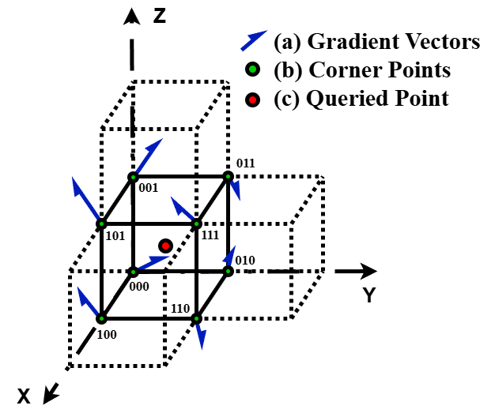
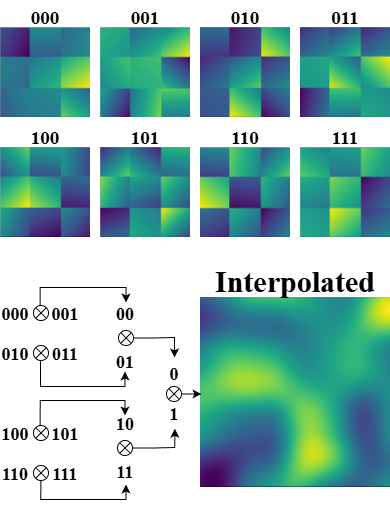
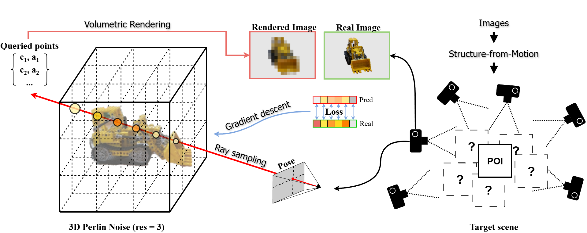

# 3DPN: Learnable 3D Perlin Noise
This branch is built for the **unbounded** setup, if you want to test the **bounded** setup, please switch branch.

This repository contains an implementation of **3DPN**, a learnable 3D scene representation based on Perlin Noise for image-domain 3D reconstruction.

> **"A Learnable 3D Perlin-Noise Representation for Image-Domain 3D Reconstruction"**  
> VISAPP 2026, Marbella, Spain
> 
> We propose 3DPN, a learnable 3D scene representation based on Perlin Noise for image-domain 3D reconstruction. 3DPN models scenes as a spatially continuous volumetric field defined by optimizable gradient vectors on a regular lattice, and rendered via differentiable volumetric rendering. We introduce a complete optimization pipeline, including automatic scene initialization from camera poses, a monotonic and gapless indexing scheme to support both bounded and unbounded scene configurations. To improve reconstruction capacity while maintaining a compact parameterization, we adopt a mixed-resolution formulation that combines multiple noise frequencies within a single volume. Owing to its analytic structure and low parameter size, 3DPN enables efficient rendering with decent frame rates. Experiments on public benchmarks and real-world captures show that 3DPN is particularly effective for compact scenes dominated by a single object, while the unbounded configuration is better suited for larger-scale scenes with extended spatial structure.
---

<p align="center">
  
   
</p>

## Overview

3DPN proposes a **non-neural, analytic representation** for reconstructing 3D scenes from multi-view images.  
Instead of using deep neural networks, the method models scenes as a **continuous volumetric field based on Perlin Noise**.

The representation is:
- Continuous
- Differentiable
- Compact
- Interpretable

<p align="center">
  
</p>

## Key Features
- **Learnable Perlin Noise Representation**
  - Scene encoded via gradient vectors on a 3D lattice
- **Differentiable Rendering**
  - End-to-end optimization using photometric loss
- **Mixed-Resolution Encoding**
  - Multi-scale noise improves detail and stability
- **Flexible Scene Modeling**
  - Supports bounded and unbounded scenes
---

## Installation
This project has been tested with the following environment:

Python: 3.8.20
CUDA: 11.8

```bash
git clone https://github.com/Racer404/3DPN.git
cd 3dpn

pip install -r requirements.txt
```

---

## Usage

### 1. Download Dataset


Download the dataset from the official source (see Resources section below).

### 2. Prepare Dataset
Extract the dataset into the `data/` directory following this structure:

```
data/
└── ├── kitchen/
          └── ├── images/
              ├── sparse/
    ├── garden/
    ├── bicycle/
    └── ...
train.py
viewer.py
```

Run the **downsampler.py** (You need to modify the target folder in the code, if you wish to change the **scaling factor**, you also have to modify the **colmap_loader.py** before training)


### 3. Train

```bash
python train.py
```


### 4. Render

```bash
python viewer.py
```

---

## 📖 Citation

```bibtex
author={Yuchen Liu and Eiji Kamioka and Phan Xuan Tan},
title={A Learnable 3D Perlin-Noise Representation for Image-Domain 3D Reconstruction},
booktitle={Proceedings of the 21st International Conference on Computer Vision Theory and Applications - Volume 3: VISAPP},
year={2026},
pages={736-747},
publisher={SciTePress},
organization={INSTICC},
doi={10.5220/0014648700004084},
isbn={978-989-758-804-4},
issn={2184-4321},
}
```

---

## 📜 License

CC BY-NC-ND 4.0

---

## 🔗 Resources

- Paper: https://www.scitepress.org/Papers/2026/146487/146487.pdf
- Mip-NeRF 360 Dataset: https://jonbarron.info/mipnerf360/
- Our Dataset "SIT_11F": https://github.com/Racer404/3DPN/releases/download/dataset/sit_11f.zip

---
